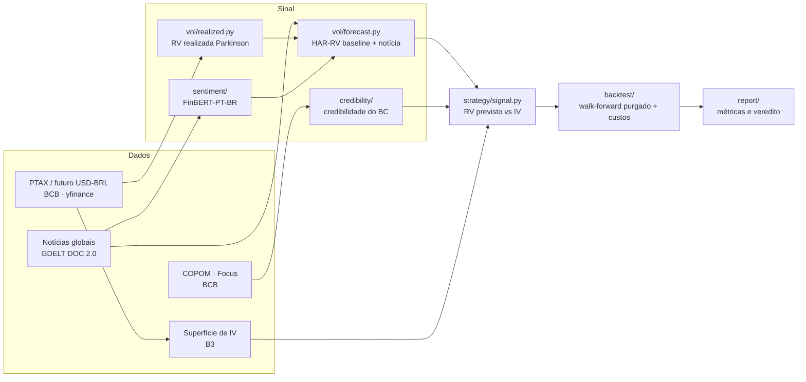

# Robô de Volatilidade USD/BRL — Desafio Itaú Asset Quant AI 2026

Estratégia quantitativa de **volatilidade em opções de dólar (USD/BRL)**, desenvolvida para o
Desafio Itaú Asset Quant AI 2026.

> **Objetivo do projeto: rigor metodológico e clareza, não retorno máximo.** O edital não pontua
> desempenho histórico de backtest — pontua conceito, modelagem, mitigação de vieses e clareza.
> Cada decisão de design abaixo prioriza correção metodológica sobre "número bonito".

## Tese central

O mercado precifica a volatilidade futura do dólar na **volatilidade implícita (IV)** das opções.
Construímos uma **previsão de volatilidade realizada (RV)** própria — combinando modelos de série
temporal (HAR-RV) com fluxo de notícias via NLP/transfer learning — e operamos o *spread* entre as
duas:

- **RV prevista > IV** → compra de volatilidade (straddle ATM)
- **RV prevista < IV** → venda de volatilidade



## Status atual

| Fase | Módulo | Status |
|---|---|---|
| 1 | Coletores (`data/`) — PTAX, IV, câmbio, GDELT, COPOM, RSS | ✅ |
| 2 | `vol/` — RV realizada (Parkinson), IV implícita (Black-76) | ✅ |
| 3 | `sentiment/` — índice diário via FinBERT-PT-BR | ✅ |
| 4 | `vol/forecast.py` — HAR-RV baseline + ablação com notícia | ✅ |
| 5 | `strategy/` — regra de sinal + sizing por vega | ✅ |
| 6 | `backtest/` — walk-forward purgado, custos, métricas | ✅ |
| 7 | `report/` — gráficos, resumo e veredito automatizado | ✅ |
| 2 (extra) | `credibility/` — credibilidade do BC via teoria dos jogos (Tier 1) | ✅ |
| — | Risco fiscal (GDELT) como feature ponderada + refinamento (surpresa/FinBERT) | 🔄 em andamento |

**197 testes automatizados** (`pytest -q`), um arquivo por módulo, verdes antes de cada avanço de fase.

## Achados até aqui (resumo honesto)

O HAR-RV baseline tem **R² fora da amostra negativo** no walk-forward purgado — ou seja, do jeito
atual, o modelo ainda não bate a previsão trivial (média histórica de RV) para o horizonte de 21
dias. As camadas testadas para tentar melhorar isso (tom de notícia via GDELT, credibilidade do BC
via Focus/meta, atenção da imprensa a risco fiscal) **não mostraram ganho consistente** de R² nas
ablações formais até agora. Isso é reportado como resultado, não escondido — o edital pontua a
capacidade de diagnosticar e comunicar isso com rigor, não de "forçar" um número bom.

## Guardrails metodológicos (invioláveis)

- **Sem look-ahead bias.** Decisão de hoje usa apenas dados até o fechamento de hoje.
- **Walk-forward purgado com embargo** (López de Prado) — nunca split aleatório em série temporal.
- **Custos realistas sempre** — spread bid-ask incluído em todo backtest.
- **Ablação obrigatória** — toda camada nova (notícia, credibilidade, risco fiscal) é comparada
  explicitamente contra o baseline sem ela, nos mesmos folds.
- **Controle de overfitting** — número de configurações testadas registrado; Deflated Sharpe Ratio
  nas métricas finais.

## Estrutura do repositório

```
data/          # coletores -> parquet (raw/ e processed/), um por fonte
vol/           # RV realizada, IV implícita (Black-76), previsão HAR-RV
sentiment/     # índice diário de sentimento/estresse via FinBERT-PT-BR
credibility/   # credibilidade do BC (Barro-Gordon) como camada extra de sinal
strategy/      # regra de sinal (RV vs IV) + sizing por vega
backtest/      # walk-forward purgado, custos/slippage, métricas robustas
report/        # script único (run_report.py) que gera gráficos e veredito
tests/         # pytest, um arquivo por módulo
```

## Como rodar

```bash
python -m venv .venv
source .venv/bin/activate          # Windows: .venv\Scripts\activate
pip install -r requirements.txt

pytest -q                          # suíte completa
python -m report.run_report        # roda o pipeline e imprime o veredito
```

## Fontes de dados (todas gratuitas)

| Dado | Fonte |
|---|---|
| Câmbio / PTAX | API SGS do Banco Central |
| Futuro de dólar (apoio) | `yfinance` (`BRL=X`) |
| Superfície de IV | B3 (preços referenciais diários) |
| Notícias globais | GDELT DOC 2.0 API |
| Notícias/atas BR | Comunicados do COPOM, RSS de veículos financeiros |
| Expectativas de inflação | Boletim Focus / BCB |

Bloomberg **não** é usado via scraping — só como enriquecimento opcional quando disponível na
competição via export do terminal.

## Datas do desafio

Pré-relatório **31/07/2026** · Entrega final **17/08/2026** · Quartas **31/08** · Semifinal
**09/09** · Final (presencial, Faria Lima) **26/09**.

## Referências

- FinBERT-PT-BR — https://huggingface.co/lucas-leme/FinBERT-PT-BR
- López de Prado, *Advances in Financial Machine Learning*
- B3 — Manual de Apreçamento de Opções
- GDELT Project — https://www.gdeltproject.org/
- Banco Central do Brasil — API SGS e Boletim Focus
