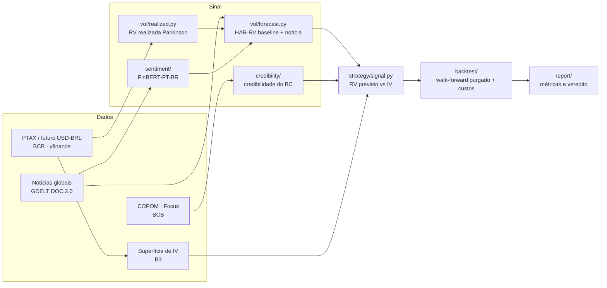

# Robô de Volatilidade USD/BRL — Desafio Itaú Asset Quant AI 2026

Estratégia quantitativa de **volatilidade em opções de dólar (USD/BRL)**, desenvolvida para o
Desafio Itaú Asset Quant AI 2026.

> **Objetivo do projeto: rigor metodológico e clareza, não retorno máximo.** O edital não pontua
> desempenho histórico de backtest — pontua conceito, modelagem, mitigação de vieses e clareza.
> Cada decisão de design abaixo prioriza correção metodológica sobre "número bonito".

## Tese central

O mercado precifica a volatilidade futura do dólar na **volatilidade implícita (IV)** das opções.
Construímos uma **previsão de volatilidade realizada (RV)** própria — combinando modelos de série
temporal (HAR-RV) com fluxo de notícias via NLP/transfer learning — e operamos o *spread* entre as
duas:

- **RV prevista > IV** → compra de volatilidade (straddle ATM)
- **RV prevista < IV** → venda de volatilidade



## Status atual

| Fase | Módulo | Status |
|---|---|---|
| 1 | Coletores (`data/`) — PTAX, futuro B3, IV, GDELT, COPOM, RSS | ✅ |
| 2 | `vol/` — RV realizada (Parkinson), Black-76 + **inversor de IV** | ✅ |
| 3 | `sentiment/` — índice diário via FinBERT-PT-BR | ✅ |
| 4 | `vol/forecast.py` — HAR-RV + ablações de camadas de informação | ✅ |
| 5 | `strategy/` — regra de sinal + sizing por vega | ✅ |
| 6 | `backtest/` — walk-forward purgado, custos, métricas, DSR | ✅ |
| 7 | `report/` — gráficos, resumo e veredito automatizado | ✅ |
| 2 (extra) | `credibility/` — credibilidade do BC via teoria dos jogos (Tier 1) | ✅ |
| extra | `data/b3_options.py` + `vol/iv_trades.py` — **IV histórica própria** | ✅ |
| extra | `vol/ml_forecast.py` + `backtest/ml_ablation.py` — XGBoost vs HAR | ✅ |
| extra | `vol/roll.py` + `backtest/roll_ablation.py` — ciclo de rolagem | ✅ |

**372 testes automatizados** (`pytest -q`), um arquivo por módulo, verdes antes de cada avanço.
**31 configurações registradas** em `report/run_report.py:CONFIGS_TESTED`, com veredito e ressalvas
de cada uma — é o registro que sustenta o Deflated Sharpe Ratio.

**Amostra:** futuro de dólar da B3 (BVBG-086), **2.135 pregões**, 2018-01-02 a 2026-08-05
(101 janelas independentes de 21 dias).

## Achados (resumo honesto)

### O resultado positivo

Em **horizonte de 1 dia** — onde o alvo não se sobrepõe e as observações são independentes de fato —
o **HAR-RV puro** (OLS sobre log-RV, features `rv_d`/`rv_w`/`rv_m`) bate a persistência com R² fora
da amostra **positivo em termos absolutos**:

| janela | n | HAR-RV | persistência | folds |
|---|---|---|---|---|
| 2023-2026 | 725 | **+0,0407** | −0,0227 | 5/5 |
| 2021-2022 | 395 | **+0,0382** | −0,0193 | 4/5 |

Direção replicada em dois períodos independentes. **Ressalva declarada:** Diebold-Mariano dá
p = 0,11 e p = 0,17 — nenhuma janela pré-registrada atinge significância a 5%. É evidência
**sugestiva, não estabelecida**. (A janela 2021-2026 daria p = 0,0017, mas foi escolhida depois de
ver quais subperíodos funcionavam — seleção pós-hoc, registrada como *não utilizável*.)

### O diagnóstico central

**Descasamento de horizonte.** A previsibilidade existe em 1 dia e decai monotonicamente até
desaparecer em 21 dias — que é o prazo de que a estratégia precisa. Não é falta de feature: é
propriedade do processo de volatilidade neste instrumento. Mecanismo medido: autocorrelação da
variância diária em lag 21 de apenas 0,025 no futuro da B3.

### O que foi testado e não funcionou

Todas as camadas de informação, em h=21 **e** reavaliadas em h=1 e h=5: tom de notícia (GDELT),
risco fiscal, sentimento fiscal via FinBERT-PT-BR, credibilidade do BC (Barro-Gordon), risco global
(VIX/DXY), correção de ciclo de rolagem. Nenhuma passa no critério de três portões
(Δ R² > 0 **e** ≥4/5 folds **e** DM p < 0,05).

**Machine learning (XGBoost)** com hiperparâmetros pré-registrados e dois base learners: o HAR-RV
linear vence em **todos** os horizontes ≥ 3. A distância do XGBoost para o HAR cresce
monotonicamente com o horizonte, acompanhando a queda de observações independentes de 1.760 para
~101 — capacidade extra não se paga onde não há amostra.

### IV histórica própria

O caminho previsto originalmente (inverter Black-76 dos **preços de ajuste** das opções) está
**fechado**: verificado em 2019, 2022 e 2026, a B3 publica ajuste para **zero** das milhares de
séries de opção de dólar. O caminho que funcionou foi inverter sobre o **preço negociado** —
7.346 negócios em 244 pregões (2018-2023), validados contra a superfície oficial da B3 dentro de
0,25 a 0,78 ponto percentual.

Primeira medição do **prêmio de risco de variância** do projeto: **1,08** contra RV futura
(1,13 contra RV trailing), com IV acima da RV em 59% dos dias — contra o multiplicador **1,29
constante** que o backtest ilustrativo assumia, calibrado num único dia.

### Quatro erros encontrados no próprio trabalho

1. **Fonte de preço desalinhada** — o `close` do yfinance para BRL=X vinha defasado 1 dia; migração
   para o futuro da B3 inverteu vários vereditos.
2. **Métrica instável** — R² médio por fold explodia com folds pequenos; adotado R² *pooled*.
3. **Monotonia por agregação** — o padrão de vol por posição no ciclo do contrato parecia monotônico
   na amostra completa e não se sustenta em nenhum fold isolado.
4. **R² não comparável entre amostras** — estender a amostra fez o R² saltar de −0,255 para +0,381,
   mas era efeito de denominador: a persistência (zero parâmetros) saltou junto, e com período de
   teste fixo o ganho real é de 1,4% no RMSE.

## Guardrails metodológicos (invioláveis)

- **Sem look-ahead bias.** Decisão de hoje usa apenas dados até o fechamento de hoje.
- **Walk-forward purgado com embargo** (López de Prado) — nunca split aleatório em série temporal.
- **Custos realistas sempre** — spread bid-ask incluído em todo backtest.
- **Ablação obrigatória** — toda camada nova (notícia, credibilidade, risco fiscal) é comparada
  explicitamente contra o baseline sem ela, nos mesmos folds.
- **Controle de overfitting** — número de configurações testadas registrado; Deflated Sharpe Ratio
  nas métricas finais.

## Estrutura do repositório

```
data/
  b3_futures.py     # futuro de dólar (BVBG-086) -- FONTE OFICIAL de preço
  b3_options.py     # negócios de opção -> IV própria via Black-76
  iv_surface.py     # superfície de IV publicada pela B3 (baseline)
  ptax.py  fx_spot.py  gdelt_news.py  copom.py  rss_news.py  global_risk.py
vol/
  realized.py       # RV realizada (Parkinson)
  black76.py        # apreçamento, gregas e INVERSOR numérico de IV (Brent)
  forecast.py       # HAR-RV + construção de datasets
  ml_forecast.py    # XGBoost (hiperparâmetros pré-registrados)
  roll.py           # ciclo de rolagem do contrato
  iv_trades.py      # negócios -> série de IV ATM -> avaliação
  implied.py  garch.py
sentiment/     # índice diário de sentimento/estresse via FinBERT-PT-BR
credibility/   # credibilidade do BC (Barro-Gordon) como camada extra de sinal
strategy/      # regra de sinal (RV vs IV) + sizing por vega
backtest/
  walk_forward.py   # split purgado com embargo (López de Prado)
  metrics.py        # R² pooled, Sharpe, PSR, Deflated Sharpe
  ablation.py  roll_ablation.py  ml_ablation.py  engine.py  costs.py
report/        # run_report.py: veredito + CONFIGS_TESTED (31 registros)
relatorio/     # gera o .docx final a partir dos dados (nada digitado à mão)
tests/         # pytest, um arquivo por módulo
```

## Como rodar

```bash
python -m venv .venv
source .venv/bin/activate          # Windows: .venv\Scripts\activate
pip install -r requirements.txt

pytest -q                          # suíte completa (372 testes)
python -m report.run_report        # pipeline + veredito em linguagem simples

python -m relatorio.gerar_dados    # recalcula TODOS os números do relatório
python -m relatorio.gerar_relatorio  # monta o .docx a partir deles
```

Experimentos individuais:

```python
from backtest.ml_ablation import run_horizon_sweep     # HAR vs XGBoost
from backtest.roll_ablation import run_horizon_sweep   # correção de rolagem
from vol.iv_trades import load_and_evaluate            # IV própria vs benchmarks
```

## Fontes de dados (todas gratuitas)

| Dado | Fonte |
|---|---|
| **Futuro de dólar (oficial)** | **B3, arquivos BVBG-086 — 2018-2026** |
| **Negócios de opção de dólar** | **B3, mesmos arquivos — IV própria via Black-76** |
| Câmbio / PTAX | API SGS do Banco Central |
| Superfície de IV | B3 (preços referenciais diários) |
| Notícias globais | GDELT DOC 2.0 API |
| Notícias/atas BR | Comunicados do COPOM, RSS de veículos financeiros |
| Expectativas de inflação | Boletim Focus / BCB |
| Risco global | VIX e DXY via `yfinance` |

> **yfinance para USD/BRL não deve ser usado.** O `close` de `BRL=X` é um snapshot no limite do dia
> (correlação 0,99998 com a abertura), não fechamento de pregão — o retorno sai defasado 1 dia.
> Validado contra o PTAX como árbitro independente. Só o `high`/`low` é confiável.

Bloomberg **não** é usado via scraping — só como enriquecimento opcional quando disponível na
competição via export do terminal.

## Referências dos métodos

- **Corsi (2009)** — HAR-RV, o modelo central.
- **Parkinson (1980)** — estimador de variância por range intradiário.
- **Black (1976)** — apreçamento de opção sobre futuro; base do inversor de IV.
- **López de Prado** — walk-forward purgado, embargo, Deflated Sharpe Ratio.
- **Bailey & López de Prado (2014)** — Deflated Sharpe Ratio.
- **Christensen, Siggaard & Veliyev (2023)**, *J. of Financial Econometrics* 21(5):1680-1727 —
  ML para previsão de volatilidade; fundamenta o desenho da ablação de XGBoost.
- **Teller, Pigorsch & Pigorsch** (SSRN 4267541) — XGBoost para RV; base learners lineares em
  horizontes longos.
- **Christensen & Prabhala (1998)**, **Poon & Granger (2003)** — IV como previsor enviesado da RV.
- **Diebold & Mariano (1995)** — teste de acurácia comparada de previsões.
- **Barro & Gordon (1983)** — credibilidade de política monetária (camada `credibility/`).
- **FinBERT-PT-BR** — https://huggingface.co/lucas-leme/FinBERT-PT-BR

## Datas do desafio

Pré-relatório **31/07/2026** · Entrega final **17/08/2026** · Quartas **31/08** · Semifinal
**09/09** · Final (presencial, Faria Lima) **26/09**.

## Fontes e documentação externa

- B3 — Manual de Apreçamento de Opções; layout BVBG-086
- GDELT Project — https://www.gdeltproject.org/
- Banco Central do Brasil — API SGS e Boletim Focus
- López de Prado, *Advances in Financial Machine Learning*
